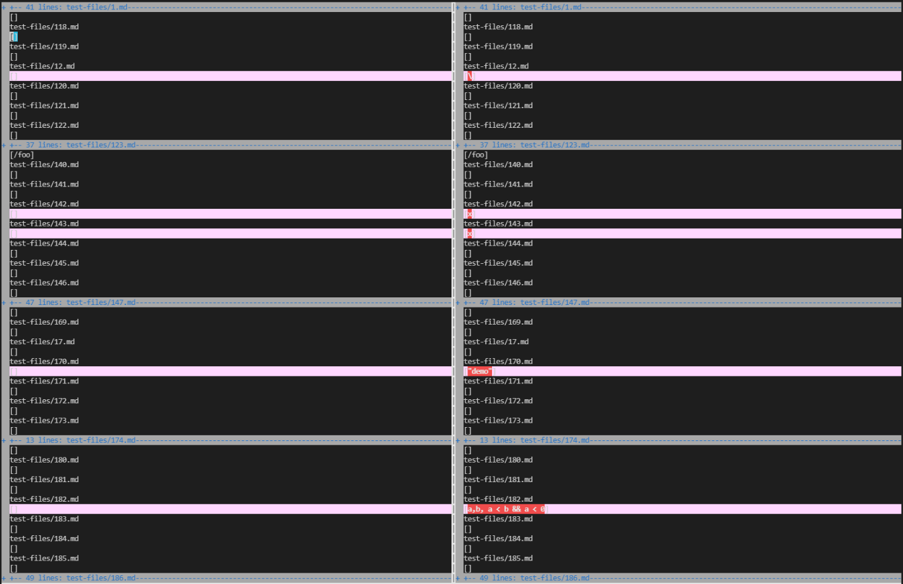
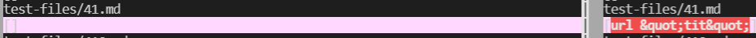

# Lab Report 5
[Main Page](https://shreyagupta112.github.io/cse15l-lab-reports/)

## Tests with Inconsistant Results
I cloned my markdown parse repository into mymdparse (an empty directory I created) and Professor Politz's markdwon parse repository othermdparse (also an empty directory I created), using `git clone`.  I copied over the test-files folder as well using `cp -r mymdparse.txt ~/mymdparse/markdown-parse/test-files`. I then ran `bash script.sh > my_results.txt` and `bash script.sh > other_results_.txt`  which returned the outputs that running markdownparse on the test-files produces. To find the differences between the two different implementations I used `diff` which finds the diffferences in the outputs between the two programs while runnign the same test files.  The command I used was  `diff ~/mymdparse/markdown-parse/other_results.txt ~/othermdparse/markdown-parse/my_results.txt > differences.txt`. 

Here is an image of the differneces, using vim: 
(I'm on the right and Politz is on the left)


## Test 1 - [22.md file](https://github.com/ucsd-cse15l-w22/markdown-parse/blob/main/test-files/52.md)

(My results are on the right and Politz's are on the left)


Both are incorrect implementations.

The expected output is `[/bar\*]`, Professor Politz's output is `[]`, and my output is `[/bar\* "ti\*tle"]`.

### Implementation
The issue with my file is that it keeps reading what is inide the quotes and doesn't check for paraenthesis.  I can fix that by adding an if statement that checks " is in the file. The following part of my code should be fixed by adding a line in the code such that whenever a parenthesis is hit, the index is returned.
```
            int openParen = line.indexOf("(", currentIndex);
            int closeParen = line.indexOf(")", openParen);
            toReturn.add(line.substring(openParen + 1, closeParen));
            currentIndex = closeParen + 1;
```


## Test 2 - [41.md file](https://github.com/ucsd-cse15l-w22/markdown-parse/blob/main/test-files/53.md)


(My results are on the right and Politz's are on the left)

The expected output is `[]`, Professor Politz's output is `[]`, and my output is `[url &quot;tit&quot;]`.

Professor Poltiz has the correct implementation because there is no link (there's a space which breaks the "link" apart).

###  Implementation
The error wiht my implemenetation is that spaces in between supposed "links" don't stop my program from reading them as real links.  I can fix my implementation by making it so that it detects spaces in between potential link and realises that it is not a real link.  In the following code section I can add a line that looks for space and stops reading the link if one is found
```
            int openParen = line.indexOf("(", currentIndex);
            int closeParen = line.indexOf(")", openParen);
            toReturn.add(line.substring(openParen + 1, closeParen));
            currentIndex = closeParen + 1;
```
